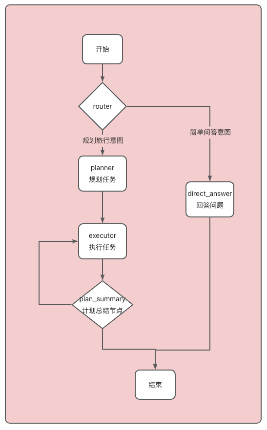

# agent
## 涉及以下技术
- plan-and-execute✔
- 短期记忆、长期记忆✔
- 人机交互✔
- 思考方式输出✔
- react
- MCP
- 聊天记录持久化✔
## 流程图

## mcp使用
1. 高德地图mcp：IP 定位、天气查询、骑行路径规划、步行路径规划、驾车路径规划、公交路径规划、距离测量、关键词搜索、周边搜索、详情搜索等。
2. 必应搜索 MCP：通用信息搜索。
3. 12306 MCP：火车票查询。

