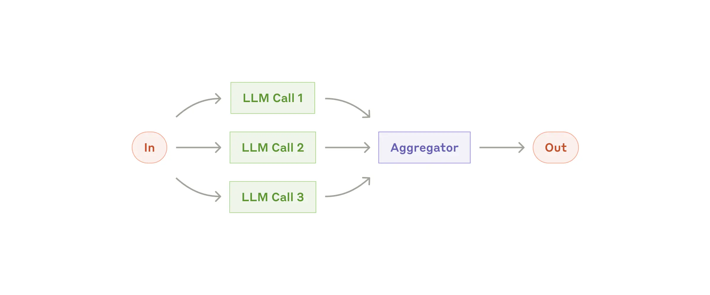
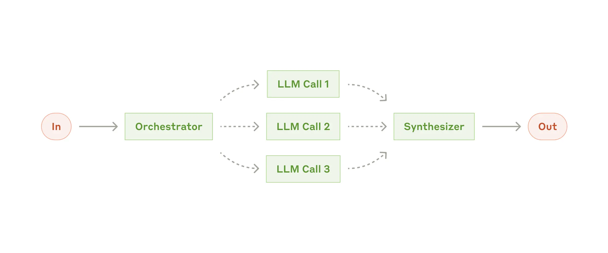
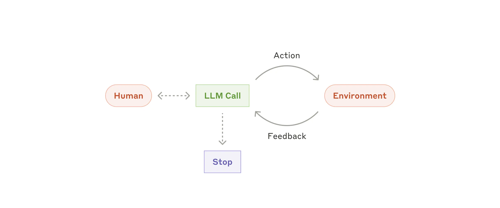
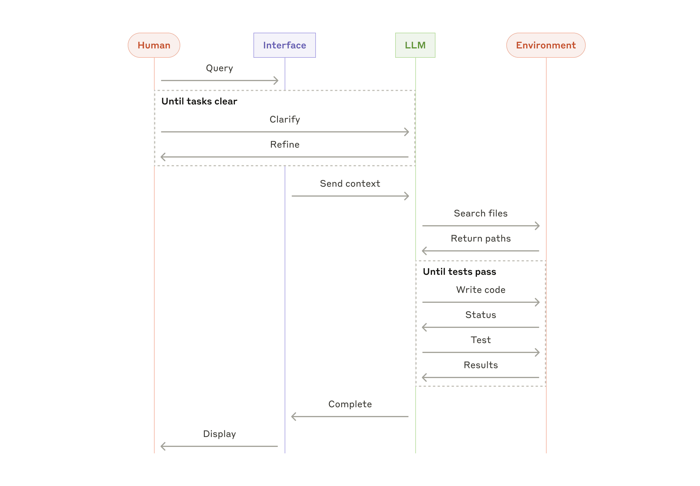

# 构建高效智能体

过去一年，我们与数十个跨行业团队合作，共同构建大语言模型（LLM）智能体。我们发现，最成功的实现方案并非依赖于复杂的框架或专用库，而是采用了简洁、可组合的设计模式。

在本文中，我们将分享从客户服务和自身智能体开发中积累的经验，并为开发者提供构建高效智能体的实用建议。

## 什么是智能体？

"智能体"一词可以有多种定义。部分客户将智能体定义为能够长期独立运行、通过多种工具完成复杂任务的完全自主系统；另一些客户则用这个术语来描述遵循预定义工作流的更具规范性的实现。在 Anthropic，我们把所有这些变体都归类为智能体系统，但在架构层面会在**工作流**和**智能体**之间做出重要区分：

- **工作流**（Workflows）是指通过预定义代码路径来编排 LLM 和工具的系统。
- **智能体**（Agents）则是指 LLM 能够动态指导自身流程和工具使用，并对如何完成任务保持控制的系统。

接下来，我们将详细探讨这两种智能体系统。在附录 1（"智能体的实践"）中，我们将介绍客户发现这类系统特别有价值的两个应用场景。

## 何时（以及何时不）使用智能体？

在使用 LLM 构建应用时，我们建议优先寻找最简单的解决方案，只在必要时才增加复杂性。这可能意味着根本不需要构建智能体系统。智能体系统通常需要用更高的延迟和成本来换取更好的任务表现，因此你需要权衡这种取舍是否值得。

当确实需要更多复杂性时，对于定义明确的任务，**工作流**能提供更好的可预测性和一致性；而当需要灵活性以及模型驱动的动态决策时，**智能体**是更好的选择。不过，对于许多应用场景而言，优化带有检索增强和上下文示例的单个 LLM 调用通常就足够了。

## 何时以及如何使用框架？

市面上有许多框架可以简化智能体系统的开发，包括：

- Claude Agent SDK
- AWS 的 Strands Agents SDK
- Rivet —— 拖拽式 GUI LLM 工作流构建工具
- Vellum —— 另一款用于构建和测试复杂工作流的 GUI 工具

这些框架通过简化底层任务（如调用 LLM、定义和解析工具、链接调用等）来降低开发门槛。然而，它们往往会引入额外的抽象层，可能掩盖底层的提示词和响应，增加调试难度。它们也可能诱使开发者在更简单的方案就足够时添加不必要的复杂性。

我们建议开发者直接从 LLM API 入手：许多模式只需几行代码即可实现。如果你确实要使用框架，请确保自己理解底层代码的实现原理。对底层机制的错误认知是导致问题的常见原因。

## 构建块、工作流和智能体

本节将介绍我们在生产环境中观察到的智能体系统的常见模式。我们从基础构建块——**增强型 LLM**——开始，逐步递进，从简单的组合工作流一直到自主智能体。

## 构建块：增强型 LLM

智能体系统的基本构建块是具备检索、工具和记忆等增强能力的 LLM。当前我们的模型已经可以主动利用这些能力——自主生成搜索查询、选择合适的工具、判断需要保留的信息。

增强型 LLM

我们建议关注两个关键实现要点：一是根据你的具体用例来定制这些增强能力；二是确保它们为 LLM 提供简洁、文档完善的接口。实现这些增强功能有多种方式，其中一种推荐方法是使用我们近期发布的**模型上下文协议**（Model Context Protocol，MCP），它允许开发者通过简洁的客户端实现与日新月异的第三方工具生态系统进行集成。

在本文后续内容中，我们假设每次 LLM 调用都能访问这些增强能力。

## 工作流：提示链

**提示链**（Prompt Chaining）将任务分解为一系列步骤，每个 LLM 调用处理前一个调用的输出。你可以在任意中间步骤添加程序化检查（见下图中的"门控"），以确保流程仍在正轨上。

提示链工作流

**适用场景**：此工作流非常适合任务可以清晰、干净地分解为固定子任务的情况。主要目标是通过让每个 LLM 调用专注于更简单的子任务来换取更高的准确性，尽管会增加延迟。

提示链适用的例子：

- 首先生成营销文案，再将其翻译成其他语言
- 先撰写文档大纲，检查大纲是否符合要求，再根据大纲完成文档

## 工作流：路由

**路由**（Routing）对输入进行分类，并将其导向专门的后续任务。此工作流实现了关注点分离，可以为不同类型的输入构建更加专业化的提示词。没有路由机制的话，对某一类输入的优化可能会损害其他输入的处理效果。

路由工作流

**适用场景**：路由适用于任务具有明显的分类维度、各类别需要分别处理，且分类能够准确完成的场景（无论通过 LLM 还是传统分类模型/算法实现）。

路由适用的例子：

- 将不同类型的客户服务查询（一般问题、退款请求、技术支持）导向不同的下游流程、提示词和工具
- 将简单/常见的问题路由至成本更优的小模型（如 Claude Haiku 4.5），将困难/复杂的问题路由至能力更强的大模型（如 Claude Sonnet 4.5），以实现最佳性能

## 工作流：并行化

LLM 有时能够同时处理同一任务，并通过程序化方式聚合结果。这种**并行化**（Parallelization）工作流有两种主要形式：

- **分块**（Sectioning）：将任务分解为独立子任务并行执行
- **投票**（Voting）：多次运行同一任务以获得多样化的输出

并行化工作流

**适用场景**：并行化在子任务可以并行执行以提升速度时非常有效，或者在需要多角度思考或多次尝试以获得更高置信度结果时同样适用。对于涉及多个考量维度的复杂任务，LLM 在每个维度由独立调用处理时通常表现更好，这样可以让模型专注于每个具体方面。

并行化适用的例子：

- **分块**：
  - 构建防护机制时，让一个模型实例处理用户查询，另一个实例负责筛选不当内容或请求。这种方案往往比在同一个 LLM 调用中同时处理防护机制和核心响应效果更好
  - 自动化评估 LLM 性能时，让每个 LLM 调用评估模型在特定提示下不同方面的表现
- **投票**：
  - 代码审查中，让多个不同的提示词分别审查代码并在发现问题时标记
  - 内容审核时，让多个提示词分别评估不同方面，或设置不同的投票阈值来平衡误报和漏报

## 工作流：编排器-工作者

在**编排器-工作者**（Orchestrator-Workers）工作流中，一个中央 LLM 动态分解任务，将其委托给多个工作者 LLM，并综合它们的结果。

编排器-工作者工作流

**适用场景**：此工作流非常适合任务复杂度较高、无法预先确定所需子任务的场景（例如在编码任务中，需要修改的文件数量和每个文件的具体修改内容都取决于任务本身）。虽然拓扑结构上与并行化相似，但关键区别在于其灵活性——子任务并非预先定义，而是由编排器根据具体输入动态决定。

编排器-工作者适用的例子：

- 每次都需要对多个文件进行复杂修改的编码工具
- 需要从多个来源收集和分析信息以获取相关内容的搜索任务

## 工作流：评估器-优化器

在**评估器-优化器**（Evaluator-Optimizer）工作流中，一个 LLM 调用负责生成响应，另一个 LLM 调用则在循环中提供评估和反馈。

评估器-优化器工作流

**适用场景**：此工作流在拥有明确评估标准、且迭代优化能够带来明显收益时特别有效。适合使用的两个标志是：第一，当人类能够给出反馈时，LLM 的响应能够明显改进；第二，LLM 能够提供有价值的反馈。这类似于人类作家在产出最终文档时可能经历的迭代写作过程。

评估器-优化器适用的例子：

- 文学翻译任务，译者 LLM 初次翻译时可能遗漏某些细微差别，而评估器 LLM 能够提供有益的批评意见
- 复杂的搜索任务，需要多轮搜索和分析才能收集到全面的信息，评估器判断是否需要进行更多搜索

## 智能体

随着 LLM 在关键能力上日趋成熟——能够理解复杂输入、进行推理和规划、可靠地使用工具、从错误中恢复——智能体开始在生产环境中涌现。智能体通过人类的指令或交互式讨论启动工作。一旦任务明确后，智能体便独立规划和执行，其间可能会返回向人类获取更多信息或判断。在执行过程中，智能体从环境中获取"真实反馈"（如工具调用结果或代码执行结果）来评估自身进展至关重要。随后，智能体可以在关键节点或遇到障碍时暂停，等待人类反馈。任务通常在完成后终止，但也常会设置停止条件（如最大迭代次数）以保持控制。

智能体能够处理复杂任务，但其实现往往非常简单。它们本质上只是在循环中基于环境反馈使用工具的 LLM。因此，清晰且周到地设计工具集及其文档至关重要。我们将在附录 2（"为工具进行提示工程"）中详细讨论工具开发的最佳实践。

自主智能体

**适用场景**：智能体适用于开放性问题，这类问题很难或无法预测所需的具体步骤，也无法硬编码固定的执行路径。LLM 可能需要运行多轮，你必须对模型的决策能力有一定程度的信任。智能体的自主性使其非常适合在可信环境中扩展任务。

智能体的自主特性意味着更高的成本支出，以及错误累积的潜在风险。我们建议在沙箱环境中进行充分测试，并配备适当的防护机制。

智能体适用的例子：

以下例子来自我们的实际实现：

- 用于解决 SWE-bench 任务的编码智能体，该任务涉及根据问题描述编辑多个文件
- 我们的"计算机使用"参考实现，Claude 通过操作计算机来完成目标任务

编码智能体的高层流程

## 组合与定制这些模式

上述构建块并非固定不变的模式。它们是开发者可以根据不同用例进行调整和组合的常见方案。成功的关键，与任何 LLM 应用开发一样，在于持续衡量性能并迭代优化实现。请牢记：只有在复杂性确实能够带来显著效果提升时，才应添加多步骤智能体系统。

## 总结

在 LLM 领域，成功的关键不在于构建最复杂的系统，而在于构建最适配自身需求的系统。从简洁的提示词开始，通过全面的评估进行优化，只在更简单的方案不足以满足需求时，才考虑引入多步骤智能体系统。

在实现智能体时，我们遵循三个核心原则：

1. **保持简洁**：智能体设计应追求简洁
2. **透明性**：明确展示智能体的规划步骤，保持过程透明
3. **精心设计 ACI**：通过完善的工具文档和测试来打造优质的智能体-计算机接口（Agent-Computer Interface，ACI）

框架可以帮助你快速起步，但在迈向生产环境时，不要犹豫移除不必要的抽象层，直接基于基础组件进行构建。遵循这些原则，你将能够创造出不仅强大，而且可靠、可维护且值得用户信赖的智能体。

## 致谢

本文由 Erik Schluntz 和 Barry Zhang 撰写。本项工作基于我们在 Anthropic 构建智能体的经验，以及客户分享的宝贵见解，对此我们深表感谢。

## 附录 1：智能体的实践

我们与客户的合作经验揭示了 AI 智能体特别有前景的两个应用领域，充分展示了上述设计模式的实际价值。这两个应用场景都表明，智能体在需要同时具备对话和行动能力、拥有明确的成功标准、支持反馈循环，并能够整合有意义的人类监督的任务上，能够发挥最大价值。

### A. 客户服务

客户服务将熟悉的聊天界面与通过工具集成增强的能力相结合。这类应用非常适合更加开放的智能体，因为：

- 支持交互自然遵循对话流程，同时需要访问外部信息并执行操作
- 可以集成工具来获取客户数据、订单历史和知识库文章
- 退款处理、工单更新等操作可以程序化执行
- 成功与否可以通过用户定义的解决方案进行明确衡量

已有数家公司通过基于使用量的定价模式验证了这一方案的可行性，只对成功解决的问题收费，这体现了对其智能体效果的高度信心。

### B. 编码智能体

软件开发领域已展现出 LLM 能力的巨大潜力，从代码补全发展到自主问题解决。智能体特别有效，因为：

- 代码解决方案可以通过自动化测试验证
- 智能体可以根据测试结果迭代优化解决方案
- 问题空间定义清晰、结构化程度高
- 输出质量可以客观衡量

在我们自己的实现中，智能体现在已经能够仅凭 Pull Request 描述来解决 SWE-bench Verified 基准测试中的真实 GitHub 问题。然而，虽然自动化测试有助于验证功能正确性，但人类审查在确保解决方案符合更广泛的系统需求方面仍然至关重要。

## 附录 2：为工具进行提示工程

无论你构建何种智能体系统，工具通常都是智能体的重要组成部分。工具使 Claude 能够通过在我们的 API 中精确指定其结构定义来与外部服务和 API 进行交互。当 Claude 响应时，如果它计划调用工具，会在 API 响应中包含一个工具调用块。工具定义和规范应该与整体提示词一样受到充分的提示工程关注。在这个简短的附录中，我们将介绍如何为工具进行提示工程。

通常，同一个动作可以有多种表达方式。例如，你可以通过编写 diff 或重写整个文件来指定文件编辑；对于结构化输出，你可以在 Markdown 中或 JSON 中返回代码。在软件工程中，这类差异只是表面性的，可以无损地相互转换。然而，某些格式对 LLM 来说编写难度更大。编写 diff 需要事先知道块头中有多少行即将更改；在 JSON 中编写代码（相比 Markdown）需要对换行符和引号进行额外转义。

我们关于确定工具格式的建议如下：

- 给模型足够的"思考"空间，让它在把自己逼入困境前能够理清思路
- 保持格式接近模型在互联网文本中自然常见的形式
- 确保没有格式"开销"，例如必须准确计算数千行代码，或对其编写的任何代码进行转义

一个实用的原则是：思考在人机交互（HCI）中投入了多少努力，就在创建良好的智能体-计算机接口（ACI）时投入同等的努力。以下是具体建议：

- 换位思考：根据描述和参数，这个工具的使用方法是否显而易见，还是需要仔细思考？如果是的话，对模型来说可能同样困难。一个好的工具定义通常应包含：使用示例、边界情况、输入格式要求，以及与其他工具的清晰边界
- 如何调整参数名称或描述让用法更加一目了然？这就像为团队中的初级开发者编写详尽的文档字符串。当使用多个相似工具时，这点尤为重要
- 测试模型如何使用你的工具：在我们的工作台中运行大量示例输入，观察模型会犯什么错误，然后不断迭代优化
- "防错"设计：调整参数定义，使错误更难发生

在为 SWE-bench 构建智能体时，我们实际上在优化工具上花费的时间比优化整体提示词还要多。例如，我们发现模型在使用相对文件路径的工具时会出错，因为智能体已经切换到了根目录以外的目录。为解决这个问题，我们将工具改为始终要求使用绝对路径——结果模型完美地掌握了这种用法。
